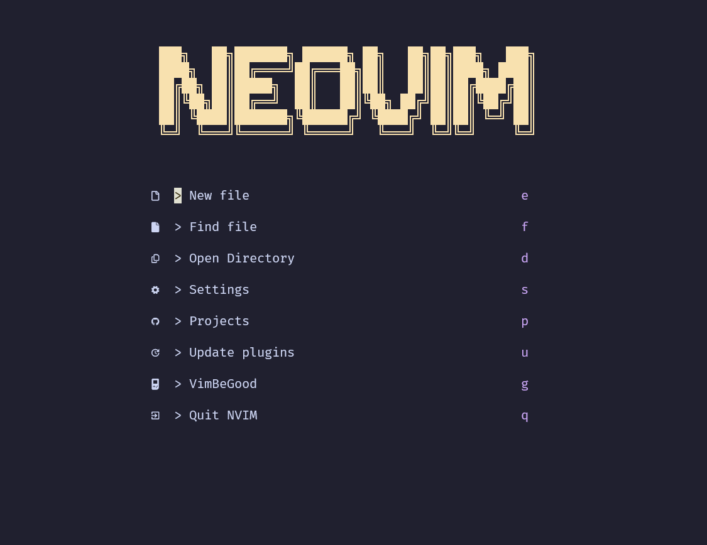

# My Neovim config file 

## Requirements

- Have Neovim installed
- Have git installed
- Have [Ripgrep](https://github.com/BurntSushi/ripgrep?tab=readme-ov-file#installation) installed for Telescope to use grep functions

## List of Plugins

- [Alpha](https://github.com/goolord/alpha-nvim) 
- [Bufferline](https://github.com/akinsho/bufferline.nvim)
- [Catppuccin themes](https://github.com/catppuccin/nvim?tab=readme-ov-file)
- [Completions](https://github.com/hrsh7th/cmp-nvim-lsp)
- [Mason](https://github.com/williamboman/mason.nvim?tab=readme-ov-file#installation)
- [Mason lspconfig](https://github.com/williamboman/mason-lspconfig.nvim?tab=readme-ov-file#installation)
- [Nvim-Tree](https://github.com/nvim-tree/nvim-tree.lua)
- [Noice](https://github.com/folke/noice.nvim)
- [None ls](https://github.com/nvimtools/none-ls.nvim)
- [Nvim Comments](https://github.com/terrortylor/nvim-comment)
- [Oil](https://github.com/stevearc/oil.nvim)
- [Telescope](https://github.com/nvim-telescope/telescope.nvim)
- [Toggleterm](https://github.com/2kabhishek/termim.nvim)
- [Treesitter](https://github.com/nvim-treesitter/nvim-treesitter/wiki/Installation)
- [Vim Be Good](https://github.com/ThePrimeagen/vim-be-good)
- [Which-key](https://github.com/folke/which-key.nvim)

## File Structure

- Nvim
    - images
        - image.png
    - lua 
        - plugins
            - plugin1.lua
            - plugin2.lua
            - plugin3.lua
        - vim-keybinds
        - vim-options
    - README.md 
    - init.lua
    - lazy-lock.json
